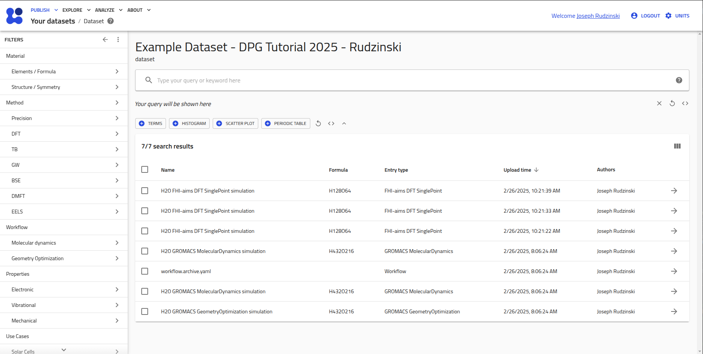

# Part 2: Using NOMAD’s API for Project Management

## 🎯 What You Will Learn

- How to interface with NOMAD using a simplified Python API
- How to (programmatically) upload data, edit metadata, create datasets, and publish data

---

## 🛠️ Programmatic Uploads

**Challenge:**
You need to upload the DFT calculations to NOMAD, but this large set of calculations were performed and are currently stored on your groups HPC cluster. (Here we will only work with 3 calculations for demonstration purposes).

**Your Solution:**
Use the **[`nomad-utility-workflows`](https://fairmat-nfdi.github.io/nomad-utility-workflows/){:target="_blank"}** module!

!!! Warning "Attention"
    The exercises below are intended to be performed in a single jupyter session (pre-filled example notebooks provided below).

## Set up / files and data

On the HPC cluster we have collected our data within the following directory structure:

```
root
├── DFT-1
│   └── 0iCl0nWwCftF0tgQOaklcQLFB68E.zip
│       ├── aims.out # FHIAims mainfile
│       └── ...other raw simulation files
├── DFT-2
│   └── 24Q4MoaAUtsWN7Hepw3UH3TU93pX.zip
│       ├── aims.out # FHIAims mainfile
│       └── ...other raw simulation files
└── DFT-3
    └── 6V_q8X39he-dakYHifH_3Z53GTdZ.zip
        ├── aims.out # FHIAims mainfile
        └── ...other raw simulation files
```

!!! NOTE
    This data was actually obtained from querying NOMAD for DFT calculations of water, with a certain number of atoms within the simulations. The zip files are named according to the corresponding `entry_id`'s of this data. Instead of supplying the test data directly here, later in this part of the tutorial, we will instead use the API functionalities to reconstruct the above structure by downloading the data directly from NOMAD.

## Install the nomad-utility-workflows plugin

If you have not done so already, follow the installation instructions [Tutorial Preparation](./index.md#tutorial-preparation).

## Linking to your NOMAD account

If you have not done so already, create a NOMAD account at [NOMAD Central Deployment](https://nomad-lab.eu/prod/v1/gui/about/information){:target="_blank"}. Click `LOGIN/REGISTER` at the top right.

Store your credentials in a file called `.env` in the root working directory for this tutorial with the following content:
```bash
NOMAD_USERNAME="MyLogin"
NOMAD_PASSWORD="MyPassWord"
```
and insert your username and password.

!!! warning "Attention"
    The environment file **MUST** be called exactly ".env" to be read in correctly with our approach.

The `.env` file you placed in the root folder will be loaded within each jupyter notebook with the command `load_dotenv()` found in next steps.
The functions within the utility module will automatically retrieve an authentication token for privileged operations, e.g., uploading data to your account.

??? tip "Tip - If your `.env` file is not found"

    If the authentication credentials from your `.env` file is not picked, add this directory to your `PYTHONPATH`:
    ```bash
    export PYTHONPATH=$PYTHONPATH:<path-to-tutorial-root-working-directory>
    ```

## NOMAD URLs / Deployments

The central NOMAD services offer several different deployments with varying purposes and versioning:

- "prod": The official NOMAD deployment.
    - Updated most infrequently (as advertised in [#software-updates](https://discordapp.com/channels/1201445470485106719/1275764272122826752) on the NOMAD Discord Server&mdash;If you are not yet a member of the NOMAD server use [Invitation to Discord :fontawesome-brands-discord:](https://discord.gg/Gyzx3ukUw8))
- "staging": The beta version of NOMAD.
    - Updated more frequently than prod in order to integrate and test new features.
- "test": A test NOMAD deployment. (**Used in this tutorial**).
    - The data is occassionally wiped, such that test publishing can be made.

Note that the "prod" and "staging" deployments share a common database, and that publishing on either will result in publically available data.

All API functions in `nomad-utility-workflows` allow the user to specify the URL with the optional keyword `url`. If you want to use the central NOMAD URLs, you can simply set `url` equal to "prod", "staging", or "test". By default, the test deployment will be used as a safety mechanism to avoid accidentally publishing during testing. Thus, for **all examples in this tutorial we will be using the test deployment**.

See [nomad-utility-workflow DOCS > NOMAD URLs](https://fairmat-nfdi.github.io/nomad-utility-workflows/how_to/use_api_functions.html#nomad-urls){:target="_blank"} for more information.

## Uploading API Basics

To demonstrate the basics of the API functionalities within `nomad-utility-workflows`, let's upload some dummy data.

You can create a `test-API.ipynb` notebook and copy over the following step by step, or download the prefilled notebook:

[Download test-API.ipynb](assets/test-API.ipynb){:target="_blank" .md-button }

Import the necessary modules/functions:

```python
from dotenv import load_dotenv
load_dotenv()
import os
import zipfile
from pprint import pprint
from nomad_utility_workflows.utils.uploads import (
    upload_files_to_nomad,
    get_upload_by_id,
    delete_upload
)

def create_zip(zip_name, dir_name):
    with zipfile.ZipFile(zip_name, 'w', zipfile.ZIP_DEFLATED) as zipf:
        for root, dirs, files in os.walk(dir_name):
            for file in files:
                zipf.write(os.path.join(root, file), os.path.relpath(os.path.join(root, file), dir_name))
```

Create an empty folder and zip it:

```python
os.makedirs('Test/', exist_ok=True)
create_zip('test.zip', 'Test/')
test_upload_fnm = './test.zip'
print(f'Zip Created: {os.path.isfile(test_upload_fnm)}')
```

Upload the zip file to the test NOMAD deployment using the `upload_files_to_nomad()` function (here we will ensure that your authentication info is set up properly):

```python
upload_id = upload_files_to_nomad(filename=test_upload_fnm, url='test')
print(upload_id)
```

??? success "example output"

    ```python
    'RdA_3ZsOTMqbtAhYLivVsw'
    ```

### Checking the upload status

The returned `upload_id` can then be used to directly access the upload, e.g., to check the upload status, using `get_upload_by_id()`:

```python
nomad_upload = get_upload_by_id(upload_id, url='test')
pprint(nomad_upload)
```

??? success "example output"
    ```python
    NomadUpload(upload_id='RdA_3ZsOTMqbtAhYLivVsw',
                upload_create_time=datetime.datetime(2024, 10, 15, 20, 2, 10, 378000),
                main_author=NomadUser(name='Joseph Rudzinski'),
                process_running=False,
                current_process='process_upload',
                process_status='SUCCESS',
                last_status_message='Process process_upload completed successfully',
                errors=[],
                warnings=[],
                coauthors=[],
                coauthor_groups=[],
                reviewers=[],
                reviewer_groups=[],
                writers=[NomadUser(name='Joseph Rudzinski')],
                writer_groups=[],
                viewers=[NomadUser(name='Joseph Rudzinski')],
                viewer_groups=[],
                published=False,
                published_to=[],
                with_embargo=False,
                embargo_length=0.0,
                license='CC BY 4.0',
                entries=1,
                n_entries=None,
                upload_files_server_path='/nomad/test/fs/staging/R/RdA_3ZsOTMqbtAhYLivVsw',
                publish_time=None,
                references=None,
                datasets=None,
                external_db=None,
                upload_name=None,
                comment=None,
                url='https://nomad-lab.eu/prod/v1/test/api/v1',
                complete_time=datetime.datetime(2024, 10, 15, 20, 2, 11, 320000))
    ```

One common usage of this function is to ensure that an upload has been processed successfully before making a subsequent action on it, e.g., editing the metadata or publishing. We will apply this functionality in the example below.

### Deleting your upload

Before moving on to the example data, let's delete this dummy upload:

```python
delete_upload(upload_id, url='test')
```

Wait a few seconds to allow for processing and then check to make sure that the upload was deleted:

```python
try:
    get_upload_by_id(upload_id, url='test')
except Exception:
    print(f'Upload with upload_id={upload_id} was deleted successfully.')
```

??? success "example output"

    ```python
    'Upload with upload_id=zpq-JTzWQJ63jtSOlbueKA was deleted successfully.'
    ```


## Working with the project Data

Now that you understand some API basics, we can move to working with the data for the tutorial example project.

Create a new notebook `Part-2_DFT-calculations.ipynb` to work step by step or download the prefilled notebook:

[Download Part-2_DFT-calculations.ipynb](assets/Part-2_DFT-calculations.ipynb){:target="_blank" .md-button }

Make all the necessary imports:

```python
from dotenv import load_dotenv
load_dotenv()
import os
import time
import json
from nomad_utility_workflows.utils.entries import download_entry_by_id
from nomad_utility_workflows.utils.uploads import (
    upload_files_to_nomad,
    get_upload_by_id,
    edit_upload_metadata,
    publish_upload
)
from nomad_utility_workflows.utils.entries import get_entries_of_upload
from nomad_utility_workflows.utils.datasets import create_dataset
```

Download the example data from NOMAD and reconstruct the directory structure introduced at the beginning.

```python
entries = ['0iCl0nWwCftF0tgQOaklcQLFB68E', '24Q4MoaAUtsWN7Hepw3UH3TU93pX', '6V_q8X39he-dakYHifH_3Z53GTdZ']
responses = []
for i_entry, entry in enumerate(entries):
    folder_nm = f'DFT-{i_entry+1}'
    os.makedirs(f'{folder_nm}', exist_ok=True)
    responses.append(download_entry_by_id(entry, url='prod', zip_file_name=os.path.join(folder_nm, f'{entry}.zip')))
```

!!! note

    Here we have specified `url='prod'` since this data is publically available on the NOMAD production deployment. Make sure to use `url='test'` (or don't specify a url) for other function calls in this tutorial!

If the API call was successful you should find a zip file within each `DFT-X` folder. You can unzip these to ensure that all the raw files are present, i.e., `aims.out`, `aims.in`, etc. You can also investigate the `response` for each API call, which contains the archive (i.e., the full (meta)data stored according to NOMAD's structured schema) for each entry.

### Iterative Uploading with Checks

Although uploads can group multiple entries together, they are limited by the maximum upload size and act more as a practical tool for optimizing the transfer of data to the NOMAD repository. For scientifically relevant connections between entries, NOMAD uses *Datasets* and *Workflows*, which will both be covered later in the tutorial.

For demonstration purposes, we will upload each of the DFT calculations individually, while implementing some checks to ensure successful processing:

```python
entries = ['0iCl0nWwCftF0tgQOaklcQLFB68E', '24Q4MoaAUtsWN7Hepw3UH3TU93pX', '6V_q8X39he-dakYHifH_3Z53GTdZ']
dft_upload_ids = []
responses = []

# define the timing parameters
max_wait_time = 60  # 60 seconds
interval = 5  # 5 seconds

for i_entry, entry in enumerate(entries):
    fnm = os.path.join(os.getcwd(), f'DFT-{i_entry+1}' ,f'{entry}.zip')
    # make the upload
    upload_id = upload_files_to_nomad(filename=fnm, url='test')
    dft_upload_ids.append(upload_id)

    # wait until the upload is processed successfully before continuing
    elapsed_time = 0
    while elapsed_time < max_wait_time:
        nomad_upload = get_upload_by_id(upload_id, url='test')

        # Check if the upload is complete
        if nomad_upload.process_status == 'SUCCESS':
            responses.append(nomad_upload)
            break

        # Wait the specified interval before the next call
        time.sleep(interval)
        elapsed_time += interval
    else:
        raise TimeoutError(f'Maximum wait time of {max_wait_time/60.} minutes exceeded. Upload with id {upload_id} is not complete.')

print(dft_upload_ids)
```

!!! note

    It is not necessary to wait between individual uploads, however, it is advisable to check that a given upload process is complete before trying to execute another process on the same upload.

## Accessing individual entries of an upload

We need to save both the `upload_id` and `entry_id` for each DFT upload for use later. As an alternative to copying them manually from the corresponding overview pages,
we can get them programmatically:

```python
dft_entry_ids = []
for upload in dft_upload_ids:
    entries = get_entries_of_upload(upload, url='test', with_authentication=True)
    assert len(entries) == 1
    dft_entry_ids.append(entries[0].entry_id)
print(dft_entry_ids)
```

This should return a list of 3 entry ids. Copy the list into your `PIDs.json` file from Part 1:


```json
{
  "upload_ids": {
    "md-workflow": "<your md workflow upload id from Part 1>",
    "DFT": [
        "<copy...",
        "the list of...",
        "dft upload ids>"
    ],
    "setup-workflow": "",
    "analysis": ""
     },
  "entry_ids": {
    "md-workflow": "<your md workflow entry id from Part 1>",
    "DFT": [
        "<copy...",
        "the list of...",
        "dft entry ids>"
    ],
    "setup-workflow": "",
    "parameters": "",
    "analysis": ""
  },
  "dataset_id": ""
}
```

??? note "Additional Exercise"
    If you were really implementing this project managment pipeline, you would of course want to save these IDs automatically without having to copy them into a file. As an additional coding exercise, you could attempt to save the IDs into your file directly from the notebook.


## Creating Datasets

Let's now create a dataset to group all of our uploaded data together, substitute `<your_name>` before running the command:

```python
dataset_id = create_dataset('Example Dataset - DPG Tutorial 2025 - <your_name>', url='test')
print(dataset_id)
```

!!! note

    Make sure to add your name or some unique identifier. Dataset names must be unique.

Copy the `dataset_id` into `PIDs.json`) for later use. (You can always find it by going to [Test Deployment > PUBLISH > Datasets](https://nomad-lab.eu/prod/v1/test/gui/user/datasets) to view all of your created datasets).

```json
{
  "upload_ids": {
    "md-workflow": "<your md workflow upload id from Part 1>",
    "DFT": ["<your list of dft upload ids from above>"],
    "setup-workflow": "",
    "analysis": ""
     },
  "entry_ids": {
    "md-workflow": "<your md workflow entry id from Part 1>",
    "DFT": ["<your list of dft entry ids from above>"],
    "setup-workflow": "",
    "parameters": "",
    "analysis": ""
  },
  "dataset_id": "<copy the dataset id here>"
}
```

### Editing the upload metadata

Now that your uploads are processed successfully, you can add coauthors, references, and other comments, as well as link to a dataset and provide a name for the upload. Note that the coauthor is specified by an email address that should correspond to the email linked to the person's NOMAD account. See more about searching for users [nomad-utility-workflows DOCS > NOMAD User Metadata](https://fairmat-nfdi.github.io/nomad-utility-workflows/how_to/use_api_functions.html#nomad-user-metadata).

The metadata should be stored as a dictionary as follows:

```python
metadata = {
    "metadata": {
    "upload_name": '<new_upload_name>',
    "references": ["https://doi.org/xx.xxxx/xxxxxx"],
    "datasets": '<dataset_id>',
    "embargo_length": 0,
    "coauthors": ["coauthor@affiliation.de"],
    "comment": 'This is a test upload...'
    },
}
```

Let's simply add a name to each upload and then link them to the dataset that we created:

```python
# dft_upload_ids - should be previously defined in your notebook
# dataset_id - should be previously defined in your notebook
responses = []

# define the timing parameters
max_wait_time = 30  # 30 seconds
interval = 5  # 5 seconds

for i_upload, upload in enumerate(dft_upload_ids):
    metadata_new = {'upload_name': f'Test Upload - DFT-{i_upload}', 'datasets': dataset_id}
    edit_upload_metadata(upload, url='test', upload_metadata=metadata_new)

    # wait until the upload is processed successfully before continuing
    elapsed_time = 0
    while elapsed_time < max_wait_time:
        nomad_upload = get_upload_by_id(upload, url='test')

        # Check if the edit upload is complete
        if nomad_upload.process_status == 'SUCCESS':
            responses.append(nomad_upload)
            break

        # Wait the specified interval before the next call
        time.sleep(interval)
        elapsed_time += interval
    else:
        raise TimeoutError(f'Maximum wait time of {max_wait_time/60.} minutes exceeded. Edit Upload with id {upload} is not complete.')
```

Let's also add the drag and drop upload with the MD data to our dataset. First, go to [Test Deployment > PUBLISH > Uploads](https://nomad-lab.eu/prod/v1/test/gui/user/uploads) and find the `upload_id` for the MD data.

```python
with open(os.path.join('<path to PIDs>', 'PIDs.json')) as f:
    pids_dict = json.load(f)

md_upload_id = pids_dict.get('upload_ids').get('md')
metadata_new = {'upload_name': f'Test Upload - MD-equilibration', 'datasets': dataset_id}
edit_upload_metadata(md_upload_id, url='test', upload_metadata=metadata_new)
```

Before moving on, let's check that this additional process is complete:

```python
nomad_upload = get_upload_by_id(md_upload_id, url='test')

print(nomad_upload.process_status == 'SUCCESS')
print(nomad_upload.process_running is False)
```

??? success "output"

    ```python
    True
    True
    ```

Now, go to your uploads page in NOMAD to verify that your uploads are now named. Go to `PUBLISH > Datasets`. You should see the dataset that you created for this tutorial. Click the arrow to the right of this dataset to view all the entries that have been added to your dataset so far:

<div class="click-zoom">
    <label>
        <input type="checkbox">
        
    </label>
</div>


## Publishing Uploads

Before publishing uploads, it is advisable to browse the individual entries to make sure there are no obvious problems, e.g., in the visualizations in the `Overview` tab or in the `LOG` tab (there is a clear <span style="color:red">red</span> `!` to indicate if there were errors in processing). Note that it is possible that the processing reports as successful while still having some errors. If you have too many uploads to inspect manually, choosing a representative subset is advisable. If you find any problems, you can receive assistance by posting on [#software-updates](https://discordapp.com/channels/1201445470485106719/1275764272122826752){:target="_blank"} on the NOMAD Discord Server&mdash;If you are not yet a member of the NOMAD server use [Invitation to Discord](https://discord.gg/Gyzx3ukUw8){:target="_blank"}.

We can publish all 4 uploads that we made so far with `publish_upload()`, making it publicly available on the Test NOMAD deployment (again these will be eventually deleted).

!!! note

    Once the upload is published you will no longer be able to make changes to the raw files that you uploaded. However, the upload metadata (accessed and edited in the above example) can be changed after publishing.

```python
all_upload_ids = [*dft_upload_ids, md_upload_id]
responses = []

# define the timing parameters
max_wait_time = 30  # 30 seconds
interval = 5  # 5 seconds

for upload in all_upload_ids:
    published_upload = publish_upload(upload, url='test')

    # wait until the upload is processed successfully before continuing
    elapsed_time = 0
    while elapsed_time < max_wait_time:
        nomad_upload = get_upload_by_id(upload, url='test')

        # Check if the edit upload is complete
        if nomad_upload.process_status == 'SUCCESS':
            responses.append(nomad_upload)
            break

        # Wait the specified interval before the next call
        time.sleep(interval)
        elapsed_time += interval
    else:
        raise TimeoutError(f'Maximum wait time of {max_wait_time/60.} minutes exceeded. Publish Upload with id {upload} is not complete.')
```

## More Resources

More detailed documentation can be found [nomad-utility-workflows DOCS > Perform API Calls](https://fairmat-nfdi.github.io/nomad-utility-workflows/how_to/use_api_functions.html).
An exhaustive list of API endpoints and commands are explained in the [NOMAD API Dashboard](https://nomad-lab.eu/prod/v1/test/api/v1/extensions/docs).
