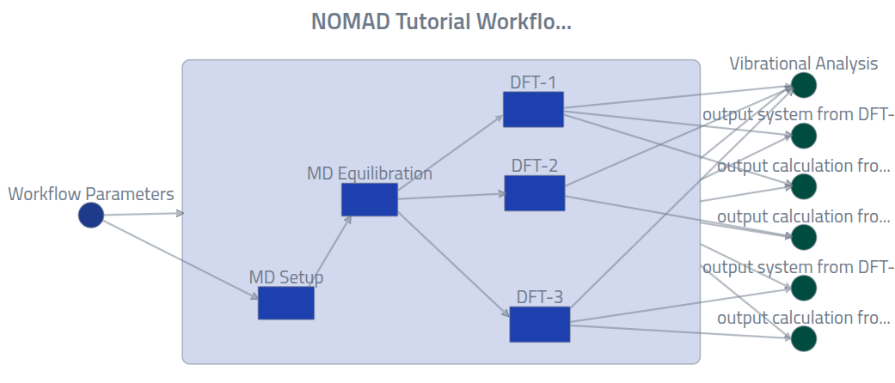
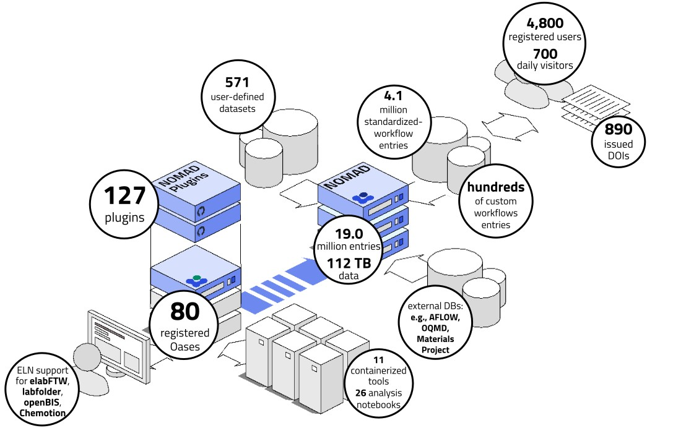

# FAIR-data management with the NOMAD infrastructure: Core functionalities

•Joseph F. Rudzinski — Physics Department and CSMB Adlershof, Humboldt-Universität zu Berlin, Germany

_In this first part of the tutorial series, an overview of the NOMAD infrastructure will be provided. Attendees will learn how NOMAD processes raw data and stores it within a generalized data structure, and the corresponding GUI features that allow users to comfortably browse data. An example scenario will also be set up for use throughout the remainder of the tutorial series: A researcher with a variety of data obtained within a project workflow would like to upload this data to NOMAD in order to link it to their manuscript while exposing the details of their (meta)data and retaining the scientifically relevant connections between the individual project tasks._


## Example Project

You are a researcher investigating the atomic structure and electronic properties of water. Your project workflow can be illustrated with the following workflow graph:

<div class="click-zoom">
    <label>
        <input type="checkbox">
        
    </label>
</div>

Overarching Workflow Tasks:

1. A series of manual or self-scripted processes for setup.

2. Classical molecular dynamics to generate preliminary structures, using a standard simulation software.

3. Single-point self-consistent-field DFT calculations to determine the electronic properties, again using a standard software.

4. Vibrational analysis using an in-house code.

_Challenge:_ You are writing a manuscript for publication and have been asked to collect all your data, appropriately document all the methodological steps in your procedure, ensuring reproducibility to the greatest extent possible, and to make your data available to the public upon publication.

_Your Approach:_ Use the NOMAD central repository!

## The NOMAD Repository and Infrastructure

NOMAD is a multifaceted software with a wide range of support for scientific research data focused towards, but not limited to, the materials science community. This tutorial will only cover a _very small fraction_ of NOMAD's functionalities, with the aim to highlight a variey of approaches for documenting data provenance (i.e., the contextual history of data) through the storage of workflow metadata.

<div class="click-zoom">
    <label>
        <header>The NOMAD Ecosystem (numbers as of Feb 2025)</header>
        <input type="checkbox">
        
    </label>
</div>

## NOMAD Basics - Processing of supported simulation data

NOMAD ingests the raw input and output files from standard simulation software by first identifying a representative file (denoted the **mainfile**) and then employing a parser code to extract relevant (meta)data from the associated files to that simulation. The (meta)data are stored within a structured schema &mdash;the NOMAD Metainfo&mdash;to provide context for each quantity, enabling interoperability and comparison between, e.g., simulation software.

<div class="click-zoom">
    <label>
        <input type="checkbox">
        
    </label>
</div>

??? Note "More Info: Organization in NOMAD"

    **Entries:** The compilation of all (meta)data obtained from this processing forms an entry─the fundamental unit of storage within the NOMAD database─including simulation input/output, author information, and additional general overarching metadata (e.g., references or comments), as well as an `entry_id` &mdash; a unique identifier.

    **Uploads:** NOMAD entries can be organized hierarchically into uploads. Since the parsing execution is dependent on automated identification of representative files, users are free to arbitrarily group simulations together upon upload. In this case, multiple entries will be created with the corresponding simulation data. An additional unique identifier, `upload_id`, will be provided for this group of entries. Although the grouping of entries into an upload is not necessarily scientifically meaningful, it is practically useful for submitting batches of files from multiple simulations to NOMAD.

    **Workflows:** NOMAD offers flexibility in the construction of workflows. NOMAD also allows the creation of custom workflows, which are completely general directed graphs, allowing users to link NOMAD entries with one another in order to provide the provenance of the simulation data. Custom workflows are contained within their own entries and, thus, have their own set of unique identifiers. To create a custom workflow, the user is required to upload a workflow yaml file describing the inputs and outputs of each entry within the workflow, with respect to sections of the NOMAD Metainfo schema.

    **Datasets:** At the highest level, NOMAD groups entries with the use of data sets. A NOMAD data set allows the user to group a large number of entries, without any specification of links between individual entries. A DOI is also generated when a data set is published, providing a convenient route for referencing all data used for a particular investigation within a publication.

    <!-- TODO - add some diagrams to explain the organization and remove anything that is not necessary to explain here? -->

## Drag and drop GUI uploads

Imagine that you have already performed a standard equilibration workflow for your molecular dynamics simulations, and have organized them in the following directory structure within a zip file:

```
workflow-example-water-atomistic.zip
├── workflow.archive.yaml
├── Emin # Geometry Optimization
│   ├── mdrun_Emin.log # GROMACS mainfile
│   └── ...other raw simulation files
├── Equil-NPT # NPT equilibration
│   ├── mdrun_Equil-NPT.log # GROMACS mainfile
│   └── ...other raw simulation files
└── Prod-NVT # NVT production
    ├── mdrun_Prod-NVT.log # GROMACS mainfile
    └── ...other raw simulation files
```

The simulations were run with the molecular dynamics simulation package GROMACS. As we will see, the `.log` files will be automatically detected as **mainfiles** of a GROMACS simulations by NOMAD, followed by the linking to corresponding auxillary files (i.e., other input/output files from that simulation) and, finally, an extraction and storage of all the relevant (metadata) within NOMAD's structured data schema.

This example data has been pre-uploaded and published on NOMAD. Go to the [example data upload page](https://nomad-lab.eu/prod/v1/gui/user/uploads/upload/id/WWGPCK-URqGmJWkh_9tElQ){:target="\_blank"} and download the example files by clicking the :fontawesome-solid-cloud-arrow-down: icon. Create a workspace folder for this tutorial, e.g., `workspace_DPG_2025/`, and then move the downloaded zip to this folder. We suggest also creating sub-folders `Part-1`-`Part-4` for organizational purposes.

!!! note "The Test NOMAD Deployment"

    All uploads in this tutorial will be sent to the Test Deployment of NOMAD. The data sent there **is not** persistent, and will be deleted occasionally. Thus, we are free to test all publishing functionalities there.

Now go to the [Test NOMAD Deployment](https://nomad-lab.eu/prod/v1/test/gui/search/entries){:target="\_blank"}, and upload the zip file that you downloaded with the example data as demonstrated in the video below:

<video width="100%" controls>
  <source src="../assets/drag-and-drop.webm" alt="File Upload" width="100%" type="video/mp4">
</video>

## Browse the entry pages

Click on the right arrows next to each processed entry to browse the overview page of each:

Workflow Entry:

<div class="click-zoom">
    <label>
        <input type="checkbox">
        
    </label>
</div>

We will need both the `upload_id` and the `entry_id` for this entry later. Copy them from the left-hand `MetaData` bar, and place them into a file called `PIDs.json` as follows:

```json
{
  "upload_ids": {
    "md-workflow": "<enter the copied upload_id here>"
  },
  "entry_ids": {
    "md-workflow": "<enter the copied entry_id here>",
    "DFT": "",
    "setup-workflow": "",
    "parameters": "",
    "analysis": ""
  },
  "dataset_id": ""
}
```

Production Simulation:

<video width="100%" controls>
  <source src="../assets/md-upload-prod.webm" alt="" width="100%" type="video/mp4">
</video>

There a 4 tabs to explore within each entry:

- **OVERVIEW**: a simple description of this entry through visualizations of the system itself, key observables, overarching metadata, workflow graph, and links to other entries (i.e., references).

- **FILES**: all the raw data that was uploaded via the .zip file, retained within the original file system structure. These can be previewed and downloaded.

- **DATA**: a browser to navigate through the populated NOMAD _Metainfo_ for this entry, i.e., the processed and normalized version of the simulation data and metadata.

- **LOGS**: technical information about the data processing along with any warnings or errors that were raised by the NOMAD software.

<!-- TODO - Anything left to explain here? -->
