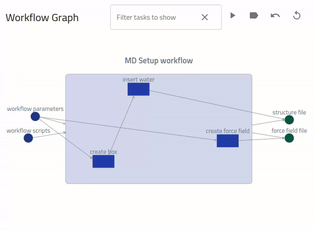
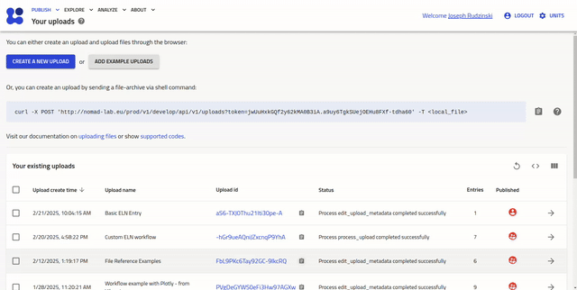
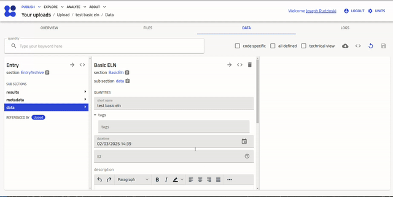
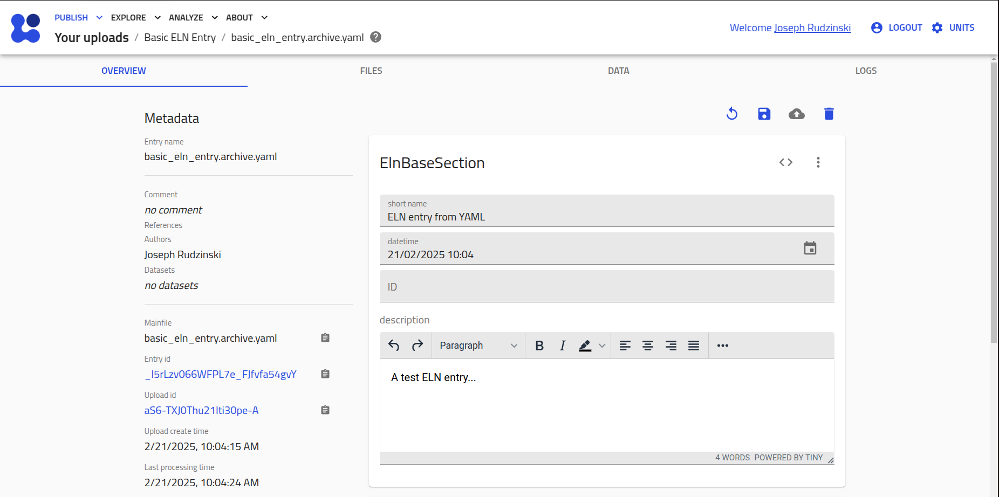

# Creating custom entries in NOMAD using yaml schema and ELN integration

•Andrea Albino — Physics Department and CSMB Adlershof, Humboldt-Universität zu Berlin, Germany

*In this part of the tutorial series, attendees will learn how to create custom entries to store data that is not already supported by one of NOMAD's parsers. The basics of writing a schema, using NOMAD's ELN (electronic lab notebook) integration, and how to create simple plots of your data to visualize in the GUI will be covered. Attendees will then use this knowledge to manage the remainder of the data from the example project workflow, which is not automatically recognized by NOMAD.*

!!! Warning "Attention"

    Preliminary draft.

## Workflow tasks executed manually or with custom scripts

*Challenge:* You need to include the simulation setup procedure with sufficient details for reproducibility, but the setup steps were performed either manually or with custom scripts, such that they will not be automatically recognized by NOMAD.

*Your Approach:* Use the NOMAD electronic lab notebook (ELN) and custom schema functionalities!

## Simulation setup steps

Imagine that to setup the MD simulations uploaded in part 1, you had to create structure and topology files. You ran 2 python scripts for this, `workflow_script_1.py` and `workflow_script_2.py`. The first script creates the simulation box (stored in `box.gro`) and inserts the water molecules (stored in `water.gro`). The second script creates the force field file (`water.top`).

You can download these 5 files and save them for later:

<center>
[Download Simulation Setup Input/Output Files](assets/simulation-setup-files.zip){:target="_blank" .md-button }
</center>

The entire setup workflow can be represented as:

<div class="click-zoom">
    <label>
        <input type="checkbox">
        
    </label>
</div>

This is the exact workflow graph that we aim to generate in NOMAD within this part of the tutorial.

## Electronic lab notebook (ELN) entries in NOMAD

<!-- @andreaa93 - I thought about it a bit, and am still a bit partial towards using the Basic ELN class here. However, feel free to change this demo to some other ELN section. Or you can leave it here in the docs and in person showcase another class, it's up to you. -->

Let's explore the basic functionalities of NOMAD ELNs. You can create a basic ELN entry from your `Uploads` page by clicking `CREATE A NEW UPLOAD > CREATE FROM SCHEMA` and selecting `Basic ELN` under the `Built-in Schema` drop-down menu, as demonstrated in this video:

<div class="click-zoom">
    <label>
        <input type="checkbox">
        
    </label>
</div>

Upon entry creation, you will be taken to the `Data` tab, where you can fill in or edit the predefined ELN quantities in the user-editable ELN interface. Type a dummy description for this entry and then press the :fontawesome-solid-floppy-disk: icon in the upper right. Now, navigate to the `Overview` page to see your changes there.

The editable quantities that you found in your ELN entry (e.g., short name, tags, ID, description) appear because they are defined within the `Basic ELN` schema that you selected in NOMAD. NOMAD provides a tool for browsing all such schemas. Go to `ANALYZE > The NOMAD MetaInfo`, then select `nomad > Basic ELN` to view all the quantity definitions and descriptions within this entry class:

<div class="click-zoom">
    <label>
        <input type="checkbox">
        
    </label>
</div>

## Creating an ELN entry from YAML

Analogous to the simulation code parsers, NOMAD has a parser for its native schema &mdash; the NOMAD MetaInfo. This parser is automatically executed for files named `<file_name>.archive.yaml`. In this way, users can create ELN entries by uploading a yaml file populated according to NOMAD's schema.

For example, we can create a basic ELN entry by creating and uploading a file with extension **.archive.yaml**, e. g. `basic_eln_entry.archive.yaml`, with the contents:

```yaml
data:
  m_def: 'nomad.datamodel.metainfo.eln.ElnBaseSection'
  name: 'ELN entry from YAML'
  description: 'A test ELN entry...'
```

The `data` section is created and defined as type `ElnBaseSection`, meaning that we can populate all the quantities (e.g., name and description) living in this section (as seen in the MetaInfo browser above).

Uploading this yaml to the test deployment (via either the API or the GUI) results in an entry with the overview page:

<div class="click-zoom">
    <label>
        <input type="checkbox">
        
    </label>
</div>

## Customizing the schema

To document our simulation setup workflow, we need to reference files within our ELN entry. For standardization and search capabilities, it is best practice to use existing classes in the MetaInfo. However, NOMAD also allows users to customize the schema to their own specific needs. Let's create our own schema to store annotated files within an ELN. Create a file `ELNFiles.archive.yaml` with the following contents:

```yaml
definitions: # Use the defintions section to create your schema
  name: 'ELN-Annotated-File-List'
  sections:
    AnnotatedFile: # A subsection for storing an annotated file
      m_annotations:
        eln:
          overview: True # Displays this quantity in the overview page of the entry
      quantities:
        file: # a quantity for storing the actualy file reference
          type: str
          description: single workflow files
          m_annotations:
            browser:
              adaptor: RawFileAdaptor  # Allows to navigate to files in the data browser
            eln:
              component: FileEditQuantity # Allows editing with the GUI
        description: # a quantity for storing the annotation
          type: str
          description: describe the file
          m_annotations:
            eln:
              component: StringEditQuantity # Allows editing within the GUI
    ELNAnnotatedFiles: # Define a subsection for storing files
      base_sections:
      - 'nomad.datamodel.metainfo.eln.ElnBaseSection' # inherits from the basic ELN class
      m_annotations:
        eln:
          hide: ['lab_id'] # hides the lab_id quantity that we will not use
      sub_sections:
        Files:
          repeats: True # makes the subsection repeating (i.e., a list)
          section: '#/AnnotatedFile' # this subsection will include the quantities defined within the `AnnotedFile` class defined above
```

The section `AnnotationFile` contains 2 quantities `file` and `description` for storing a file reference and annotation, respectively. The section `ELNAnnotatedFiles` extends the most basic ELN implementation (`ElnBaseSection`) with a repeating subsection of type `AnnotatedFile`. In this way, our ELN will be able to store a list of annotated files.

??? tip "More on custom schemas"

    The YAML approach is a quick and dirty way to customize your NOMAD entries. It doesn't allow for complete integration of custom defined quantities within the database bacause the schema is injested via YAML file while NOMAD platform is running, in contrast to the quantities belonging to schemas organized in **plugins** (python packages) and installed in NOMAD during deployment. See [NOMAD Docs > How to write a YAML schema package](https://nomad-lab.eu/prod/v1/test/docs/howto/customization/basics.html){:target="_blank"} for more details about defining custom schemas in this way.

    The more robust and powerful approach for creating custom schemas is to create a *schema plugin* (see [NOMAD Docs > How to get started with plugins](https://nomad-lab.eu/prod/v1/test/docs/howto/plugins/plugins.html){:target="_blank"}).

    Useful resources for plugin developers are the [Plugin Template](https://github.com/FAIRmat-NFDI/nomad-plugin-template)and the [NOMAD Distro Template](https://github.com/FAIRmat-NFDI/nomad-distro-template).


We can now use these defintions to create an entry file for the step of creating the force field file (as illustrated in the image above):

`create_force_field.yaml`
```yaml
data:
  m_def: '../upload/raw/Custom_ELN_Entries/ELNFiles.archive.yaml#ELNAnnotatedFiles'
  name: 'Create force field'
  description: 'The force field is defined for input to the MD simulation engine.'
  Files:
  - file: 'Custom_ELN_Entries/water.top'
    description: 'The force field file for simulation input.'
```

Here we define the data section using our `ELNFiles.archive.yaml` schema. The given path is a relative path assuming that we will upload these 2 files (i.e., `ELNFiles.archive.yaml` and `create_force_field.yaml`) within the same upload with a root folder called `Custom_ELN_Entries`.

You can now create analogous files `create_box.archive.yaml`, `insert_water.archive.yaml`, `workflow_parameters.archive.yaml`, `workflow_scripts.archive.yaml`:

??? success "`create_box.archive.yaml`"

    ```yaml
        data:
        m_def: '../upload/raw/Custom_ELN_Entries/ELNFiles.archive.yaml#ELNAnnotatedFiles'
        name: 'Create box'
        description: 'The initial simulation box is created.'
        Files:
        - file: 'Custom_ELN_Entries/box.gro'
            description: 'An empty structure file with the box vectors.'
    ```

??? success "`insert_water.archive.yaml`"

    ```yaml
        data:
        m_def: '../upload/raw/Custom_ELN_Entries/ELNFiles.archive.yaml#ELNAnnotatedFiles'
        name: 'Insert water'
        description: 'Water is inserted into the simulation box, creating the structure file for simulation input.'
        Files:
        - file: 'Custom_ELN_Entries/water.gro'
            description: 'The structure file for simulation input.'
    ```

??? success "`insert_water.archive.yaml`"

    ```yaml
        data:
        m_def: '../upload/raw/Custom_ELN_Entries/ELNFiles.archive.yaml#ELNAnnotatedFiles'
        name: 'Insert water'
        description: 'Water is inserted into the simulation box, creating the structure file for simulation input.'
        Files:
        - file: 'Custom_ELN_Entries/water.gro'
            description: 'The structure file for simulation input.'
    ```

??? success "`workflow_parameters.archive.yaml`"

    ```yaml
        data:
        m_def: nomad.datamodel.metainfo.eln.ElnBaseSection
        name: 'Workflow Parameters'
        description: 'This is a description of the overall workflow parameters, or alternatively standard workflow specification...'
    ```

??? success "`workflow_scripts.archive.yaml`"

    ```yaml
        data:
        m_def: '../upload/raw/Custom_ELN_Entries/ELNFiles.archive.yaml#ELNAnnotatedFiles'
        name: 'Workflow Scripts'
        description: 'All the scripts run during setup of the MD simulation.'
        Files:
        - file: 'Custom_ELN_Entries/workflow_script_1.py'
            description: 'Creates the simulation box and inserts water molecules.'
        - file: 'Custom_ELN_Entries/workflow_script_2.py'
            description: 'Creates the appropriate force field files for the simulation engine.'
    ```


## Creating a custom workflow in NOMAD

NOMAD allows users to connect entries into a workflow, i.e., a directed graph structure. This is achieved using the same parsing functionality as demonstrated with the custom schemas above. In this case, we simply populate the `workflow2` section instead of the `data` section. When uploaded to NOMAD, a new *workflow* entry will be created, with references to each of the workflow tasks, and also an interactive workflow graph for easy navigation of the entire workflow.

Let's construct this workflow yaml piece by piece, starting with the section definition and global inputs/outputs:

```yaml
'workflow2':
  'name': 'MD Setup workflow'
  'inputs':
  - 'name': 'workflow parameters'
    'section': '<path_to_mainfile>/workflow_parameters.archive.yaml#/data'
  - 'name': 'workflow scripts'
    'section': '<path_to_mainfile>/workflow_scripts.archive.yaml#/data/Files'
  'outputs':
  - 'name': 'structure file'
    'section': '<path_to_mainfile>/insert_water.archive.yaml#/data/Files/0/file'
  - 'name': 'force field file'
    'section': '<path_to_mainfile>/create_force_field.archive.yaml#/data/Files/0/file'
```

To simply, we have replaced the full path to each yaml file with a variable: `<path_to_mainfile> = ../upload/archive/mainfile/Custom_ELN_Entries/`. As we already saw above, the `../upload/` syntax is used to access files that were uploaded together. The `archive/mainfile` directory can be used to access all the mainfiles (i.e., files automatically recognized by NOMAD). `Custom_ELN_Entries/` is the user-defined folder in which the upload is contained.

This workflow takes as input the entire workflow parameters entry and a list of workflow scripts, and outputs the structure and force field files.

We now need to define each task, which contains its own inputs and outputs, e.g., the task that creates the force field file:

```yaml
'workflow2':
... ### I/Os
  'tasks':
... ### Other tasks
  - 'm_def': 'nomad.datamodel.metainfo.workflow.TaskReference'
    'name': 'create force field'
    'task': '<path_to_mainfile>/create_force_field.archive.yaml#/data'
    'inputs':
    - 'name': 'workflow parameters'
      'section': '<path_to_mainfile>/workflow_parameters.archive.yaml#/data'
    - 'name': 'workflow script 2'
      'section': '<path_to_mainfile>/workflow_scripts.archive.yaml#/data/Files/1/file'
    'outputs':
    - 'name': 'force field file'
      'section': '<path_to_mainfile>/create_force_field.archive.yaml#/data/Files/0/file'
```

This task is linked to the entry defined in `create_force_field.archive.yaml`. It takes as input: 1. the entire workflow parameters entry, defined in `workflow_parameters.archive.yaml`, and 2. The second file stored in the files list within the workflow scripts entry, defined by `workflow_scripts.archive.yaml`. The output of this task is the force field file, which is the first file stored in the file list of the create for field entry.


You can now add the "create box" and "insert water" tasks to create the final workflow file:

??? success "`setup_workflow.archive.yaml`"
    ```yaml
    'workflow2':
    'name': 'MD Setup workflow'
    'inputs':
    - 'name': 'workflow parameters'
        'section': '<path_to_mainfile>/workflow_parameters.archive.yaml#/data'
    - 'name': 'workflow scripts'
        'section': '<path_to_mainfile>/workflow_scripts.archive.yaml#/data/Files'
    'outputs':
    - 'name': 'structure file'
        'section': '<path_to_mainfile>/insert_water.archive.yaml#/data/Files/0/file'
    - 'name': 'force field file'
        'section': '<path_to_mainfile>/create_force_field.archive.yaml#/data/Files/0/file'
    'tasks':
    - 'm_def': 'nomad.datamodel.metainfo.workflow.TaskReference'
        'name': 'create box'
        'task': '<path_to_mainfile>/create_box.archive.yaml#/data'
        'inputs':
        - 'name': 'workflow parameters'
        'section': '<path_to_mainfile>/workflow_parameters.archive.yaml#/data'
        - 'name': 'workflow script 1'
        'section': '<path_to_mainfile>/workflow_scripts.archive.yaml#/data/Files/0/file'
        'outputs':
        - 'name': 'initial box'
        'section': '<path_to_mainfile>/create_box.archive.yaml#/data/Files/0/file'
    - 'm_def': 'nomad.datamodel.metainfo.workflow.TaskReference'
        'name': 'insert water'
        'task': '<path_to_mainfile>/insert_water.archive.yaml#/data'
        'inputs':
        - 'name': 'initial box'
        'section': '<path_to_mainfile>/create_box.archive.yaml#/data/Files/0/file'
        - 'name': 'workflow script 1'
        'section': '<path_to_mainfile>/workflow_scripts.archive.yaml#/data/Files/0/file'
        'outputs':
        - 'name': 'structure file'
        'section': '<path_to_mainfile>/insert_water.archive.yaml#/data/Files/0/file'
    - 'm_def': 'nomad.datamodel.metainfo.workflow.TaskReference'
        'name': 'create force field'
        'task': '<path_to_mainfile>/create_force_field.archive.yaml#/data'
        'inputs':
        - 'name': 'workflow parameters'
        'section': '<path_to_mainfile>/workflow_parameters.archive.yaml#/data'
        - 'name': 'workflow script 2'
        'section': '<path_to_mainfile>/workflow_scripts.archive.yaml#/data/Files/1/file'
        'outputs':
        - 'name': 'force field file'
        'section': '<path_to_mainfile>/create_force_field.archive.yaml#/data/Files/0/file'
    ```

Place all of the completed files into a folder called `Custom_ELN_Entries/`. Don't forget to replace `<path_to_mainfile>` with `../upload/archive/mainfile/Custom_ELN_Entries/`. Alternatively, you can download the completed yamls here:

<center>
[Download Simulation Setup YAMLs](assets/simulation-setup-yamls.zip){:target="_blank" .md-button}
</center>

## Uploading and publishing

We now need to upload these files, edit the metadata, and publish the upload. You have the choice to use either the GUI, as demonstrated in Part 1, or the API, as demonstrated in Part 2.

### Using the GUI

If you use the GUI upload, you will need to find and use the `Edit Metadata` button on the uploads page in order to add the `dataset_id` manually to link the upload with your dataset.

Once you have published the upload, continue with [Saving the PIDs](#saving-the-pids) below.

### Using the API

Create a new notebook `Custom_ELN_Entries.ipynb` to try the steps below on your own or download the prefilled notebook:

<center>
[Download Custom_ELN_Entries.ipynb](assets/Custom_ELN_Entries.ipynb){:target="_blank" .md-button }
</center>

- Make the imports:

??? success "Solution"

    ```python
    import os
    import time
    from nomad_utility_workflows.utils.uploads import (
        upload_files_to_nomad,
        get_upload_by_id,
        edit_upload_metadata,
        publish_upload
    )
    ```

- Zip the folder for upload:

??? success "Solution"

    ```python
    os.system('zip -r Custom_ELN_Entries.zip Custom_ELN_Entries/')
    ```

- Upload to NOMAD and check for completion of processing:

??? success "Solution"

    ```python
    fnm = 'Custom_ELN_Entries.zip'

    # define the timing parameters
    max_wait_time = 60  # 60 seconds
    interval = 5  # 5 seconds

    # make the upload
    eln_entries_upload_id = upload_files_to_nomad(filename=fnm, url='test')

    # wait until the upload is processed successfully before continuing
    elapsed_time = 0
    while elapsed_time < max_wait_time:
        nomad_upload = get_upload_by_id(eln_entries_upload_id, url='test')

        # Check if the upload is complete
        if nomad_upload.process_status == 'SUCCESS':
            break

        # Wait the specified interval before the next call
        time.sleep(interval)
        elapsed_time += interval
    else:
        raise TimeoutError(f'Maximum wait time of {max_wait_time/60.} minutes exceeded. Upload with id {eln_entries_upload_id} is not complete.')

    print(eln_entries_upload_id)
    ```

- Add a title and link to your dataset:

??? success "Solution"

    ```python
    dataset_id = '<your dataset id>'
    metadata_new = {'upload_name': f'Test Upload - ELN Entries', 'datasets': dataset_id}
    _ = edit_upload_metadata(eln_entries_upload_id, url='test', upload_metadata=metadata_new)
    time.sleep(10)
    nomad_upload = get_upload_by_id(eln_entries_upload_id, url='test')

    print(nomad_upload.process_status == 'SUCCESS')
    print(nomad_upload.process_running is False)
    ```

- Go to NOMAD and inspect your upload. If everything looks correct, go ahead and publish the upload:

??? success "Solution"

    ```python
    # define the timing parameters
    max_wait_time = 30  # 30 seconds
    interval = 5  # 5 seconds

    published_upload = publish_upload(eln_entries_upload_id, url='test')

    # wait until the upload is processed successfully before continuing
    elapsed_time = 0
    while elapsed_time < max_wait_time:
        nomad_upload = get_upload_by_id(eln_entries_upload_id, url='test')

        # Check if the edit upload is complete
        if nomad_upload.process_status == 'SUCCESS':
            break

        # Wait the specified interval before the next call
        time.sleep(interval)
        elapsed_time += interval
    else:
        raise TimeoutError(f'Maximum wait time of {max_wait_time/60.} minutes exceeded. Publish Upload with id {eln_entries_upload_id} is not complete.')
    ```

## Saving the PIDs

For Part 4, we will need the entry ids for the setup workflow entry and the workflow parameters entry (input for the md setup workflow). Find the proper entry ids using the GUI or the `get_entries_of_upload()` method as in Part 2. Copy the `entry_id` for each into your `PIDs.json` file:

```json
{
  "upload_ids": {
    "md-workflow": "<your md workflow upload id from Part 1>"
	 },
  "entry_ids": {
    "md-workflow": "<your md workflow entry id from Part 1>",
    "DFT": ["<your list of dft entry ids from above>"],
    "setup-workflow": "",
    "parameters": "<copy the workflow parameters entry id here>",
    "analysis": ""
  },
  "dataset_id": "<your dataset id>"
}
```
