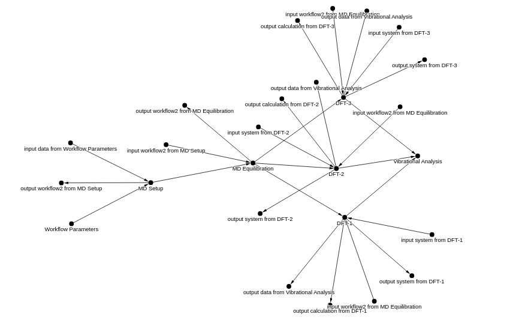

# Creating custom workflow entries in NOMAD to link multiple uploads

•Bernadette Mohr — Physics Department and CSMB Adlershof, Humboldt-Universität zu Berlin, Germany

_In this last part of the tutorial series, attendees will complete the example project workflow storage by creating a custom workflow entry in NOMAD that connects all the uploaded tasks. The basics of the schema for defining custom workflows will be covered, followed by a demonstration of the straightforward creation of the required workflow file using the same workflow utility Python module as in the first part of the tutorial series. Finally, attendees will navigate NOMAD's interactive workflow graph visualizations to investigate the uploaded data, and learn how to obtain a DOI for their workflow._

!!! Warning "Attention"

    Preliminary draft.

    Note that the overarching workflow yaml generation below will only work with version 0.0.15 of `nomad-utility-workflows`. Please report any issues that you have as recent changes may still contain bugs.

## Workflow tasks executed manually or with custom scripts

Workflows are an important aspect of data as they explain how the data was generated and are essential for reproducibility. In this sense, a workflow has already happened and has produced input and output data that are linked through tasks that have been performed. This often is also referred to as data provenance or provenance graph.

_Challenge:_

1. You now need to create an overarching workflow that documents the steps executed in your project.

2. You also want to showcase some of the analysis plots that you created from the data generated by the workflow.

_Your Approach:_

1. Use NOMAD's plotly functionalities to create entries with custom plots on the overview page.

2. Use `nomad-utility-workflows` to generate a workflow YAML for the overarching workflow.

## Plotting Entry

You have performed some vibrational analysis of the DFT configurations obtained from your simulations. The results are shown below. Create a file `result-vibrational-analysis-DFT.csv` to store the results:

```txt
electron_density,oh_stretch_frequency
e/A^3,1/cm
0.0102,3601.
0.0125,3554.
0.0140,3507.
0.0158,3473.
0.0169,3448.
0.0184,3392.
0.0195,3355.
0.0208,3321.
0.0223,3289.
0.0236,3267.
0.0248,3230.
0.0261,3194.
```

NOMAD has a variety of tools, including plotting functionalities, that can be utilized when defining a custom schema. Let's create an ELN entry that will plot the results of the vibrational analysis. Create a file `vibrational_plot_schema.archive.yaml` with the following content:

```yaml
"definitions":
  "name": This is a parser for vibrational analysis data in the .csv format
  "sections":
    "Vibrational_Analysis":
      "base_sections":
        - nomad.datamodel.data.EntryData
        - nomad.parsing.tabular.TableData
        - nomad.datamodel.metainfo.plot.PlotSection
      "quantities":
        "data_file":
          "type": str
          "descritpion": Upload your .csv data file
          "m_annotations":
            "eln":
              "component": FileEditQuantity
            "browser":
              "adaptor": RawFileAdaptor
            "tabular_parser":
              "parsing_options":
                "comment": "#"
                "skiprows": [1]
              "mapping_options":
                - "mapping_mode": column
                  "file_mode": current_entry
                  "sections":
                    - "#root"
        "Electron_Density":
          "type": np.float64
          "shape": ["*"]
          "m_annotations":
            "tabular":
              "name": electron_density
        "OH_Stretch_Frequency":
          "type": np.float64
          "shape": ["*"]
          "m_annotations":
            "tabular":
              "name": oh_stretch_frequency
      "m_annotations":
        "plotly_graph_object":
          "data":
            "x": "#Electron_Density"
            "y": "#OH_Stretch_Frequency"
          "layout":
            "title": Vibrational Analysis
```

Here we will not describe in detail the plotting annotations. Rather, this serves as a simple demonstration that custom plotting is possible. In practice, there are various routes for creating custom visualizations. See [NOMAD Docs > Reference > Annotations](https://nomad-lab.eu/prod/v1/test/docs/reference/annotations.html#annotations){:target="blank"} for more information.

To create an entry according to this schema, create the file `vibrational_analysis.archive.yaml` with the following contents:

```yaml
"data":
  "m_def": "../upload/raw/vibrational_plot_schema.archive.yaml#Vibrational_Analysis"
  "data_file": "result-vibrational-analysis-DFT.csv"
```

Alternatively, you can download all 3 files here:

<center>
[Download Vibrational Analysis Files](assets/vibrational-analysis-files.zip){:target="_blank" .md-button}
</center>

Now we can once again use either the GUI or the API to upload, edit metadata (add a title and link to the dataset), and publish. We will not repeat the steps here, but encourage you to try to repeat the API steps on your own. You can also download the prefilled `Vibrational_Analysis.ipynb` to perform these steps:

<center>
[Download Vibrational Analysis Upload and Publish Notebook](assets/Vibrational_Analysis_Entry.ipynb){:target="_blank" .md-button}
</center>

After you have completed the publishing, save the `entry_id` to your `PIDs.json`, as we will need it in the final section of the tutorial below:

```json
{
  "upload_ids": {
    "md-workflow": "<your md workflow upload id from Part 1>"
  },
  "entry_ids": {
    "md-workflow": "<your md workflow entry id from Part 1>",
    "DFT": ["<your list of dft entry ids from above>"],
    "setup-workflow": "<your setup workflow entry id from Part 3>",
    "parameters": "<your workflow parameters entry id from Part 3>",
    "analysis": "<copy the vibrational analysis entry id here>"
  },
  "dataset_id": "<your dataset id>"
}
```

## Creating the overarching project workflow

Now that all the individual tasks and sub-workflows for the project are stored in the NOMAD repository, we need to create an overarching workflow to connect these components. The final workflow graph should look as follows:

<div class="click-zoom">
    <label>
        <input type="checkbox">
        
    </label>
</div>

As in Part 3, we could create the necessary `archive.yaml` manually. However, there are many cases where this can be quite tedious and require detailed knowledge of the NOMAD schema. For that reason `nomad-utility-workflows` includes some tools for automating the generation of this file. In the following, we will demonstrate the basic functionalities of these tools. For more details see [`nomad-utility-workflow` Docs](https://fairmat-nfdi.github.io/nomad-utility-workflows/index.html){:target="blank"}.

## Creating a graph representation of the project workflow

Create a new notebook `Generate_Workflow_Yaml.ipynb` to work step by step or download the prefilled notebook:

<center>
[Download Generate_Workflow_Yaml.ipynb](assets/Generate_Workflow_Yaml.ipynb){:target="_blank" .md-button }
</center>

Make the imports:

```python
import json
import gravis as gv
import networkx as nx
from nomad_utility_workflows.utils.workflows import build_nomad_workflow, nodes_to_graph
```

Load the saved PIDs:

```python
with open(os.path.join('<path to PIDs>', 'PIDs.json')) as f:
    pids_dict = json.load(f)
entry_ids = pids_dict.get('entry_ids')
print(entry_ids)
```

Create a dictionary with inputs, outputs, and tasks as follows:

```python
node_attributes = {
    0: {'name': 'Workflow Parameters',
        'type': 'input',
        'path_info': {
            'entry_id': entry_ids.get('parameters'),
            'mainfile_path': 'workflow_parameters.archive.yaml',
            'archive_path': 'data',}
       },
    1: {'name': 'MD Setup',
        'type': 'workflow',
        'path_info': {
            'entry_id': entry_ids.get('eln'),
            'mainfile_path': 'setup_workflow.archive.yaml'},
        'in_edge_nodes': [0],
       },
    2: {'name': 'MD Equilibration',
    'type': 'workflow',
    'path_info': {
        'entry_id': entry_ids.get('md-workflow'),
        'mainfile_path': 'workflow.archive.yaml'},
    'in_edge_nodes': [1],
       },
    3: {'name': 'DFT-1',
    'type': 'workflow',
    'path_info': {
        'entry_id': entry_ids.get('DFT')[0],
        'mainfile_path': 'aims.out'
    },
    'in_edge_nodes': [2],
    'out_edge_nodes': [6],
    },
    4: {'name': 'DFT-2',
        'type': 'workflow',
        'path_info': {
            'entry_id': entry_ids.get('DFT')[1],
            'mainfile_path': 'aims.out'
        },
        'in_edge_nodes': [2],
        'out_edge_nodes': [6],
    },
    5: {'name': 'DFT-3',
        'type': 'workflow',
        'path_info': {
            'entry_id': entry_ids.get('DFT')[2],
            'mainfile_path': 'aims.out'
        },
        'in_edge_nodes': [2],
        'out_edge_nodes': [6],
    },
    6: {'name': 'Vibrational Analysis',
        'type': 'output',
        'path_info': {
            'entry_id': entry_ids.get('analysis'),
            'mainfile_path': 'vibrational_analysis.archive.yaml',
            'archive_path': 'data'
        },
    }
  }
```

This dictionary of node attributes directly informs the creation of the workflow YAML without explicitly referencing specific sections of the NOMAD schema. Specification of the mainfile recognized by the NOMAD parsers is required. In this case, we also include the appropriate entry ids to link together the entries that we have already created. Detailed information about all possible attributes can be found in [`nomad-utility-workflows` Docs > Explanation > Workflows](https://fairmat-nfdi.github.io/nomad-utility-workflows/explanation/workflows.html){:target="\_blank"}

Now, to create a graph of your workflow simply run:

```python
workflow_graph_input = nodes_to_graph(node_attributes)
```

The result can be visualized with:

```python
gv.d3(
    workflow_graph_input,
    node_label_data_source='name',
    edge_label_data_source='name',
    zoom_factor=1.5,
    node_hover_tooltip=True,
)
```

<div class="click-zoom">
    <label>
        <input type="checkbox">
        
    </label>
</div>

## Generate the workflow yaml

First designate the full path and filename for your YAML and a name for your workflow:

```python
workflow_metadata = {
    'destination_filename': './project_workflow.archive.yaml',
    'workflow_name': 'DPG Tutorial 2025 Project Workflow',
}
```

The workflow name will show up on top of the workflow graph visualization on the overview page of the workflow entry that we will create.

We can now use the generated graph to create the workflow YAML using the `build_nomad_workflow()` function:

```
workflow_graph_output = build_nomad_workflow(
    workflow_metadata=workflow_metadata,
    workflow_graph=nx.DiGraph(workflow_graph_input),
    write_to_yaml=True,
)
```

Another workflow graph is returned by this function:

```python
gv.d3(
    workflow_graph_output,
    node_label_data_source='name',
    edge_label_data_source='name',
    zoom_factor=1.5,
    node_hover_tooltip=True,
)
```

<div class="click-zoom">
    <label>
        <input type="checkbox">
        
    </label>
</div>

We see that our output graph looks signficantly different than the input. That's because `nomad-utility-workflow` is automatically adding some default inputs/outputs to ensure the proper node connections within the workflow visualizer. For nodes without an `entry_type`, these default connections work by simply adding inputs/outputs that point to the mainfile of one of the nodes connected by an edge in the graph.

??? success "example `project_workflow.archive.yaml`"

    ```yaml
    'workflow2':
      'name': 'DPG Tutorial 2025 Project Workflow'
      'inputs':
      - 'name': 'Workflow Parameters'
        'section': '/entries/tc_dLqPqR9lqLT1JbFr0IfZ1n39e#/data'
      'outputs':
      - 'name': 'Vibrational Analysis'
        'section': '/entries/-vSRAs4_EcgqGx8XCZ5slhsW_xTN#/data'
      'tasks':
      - 'm_def': 'nomad.datamodel.metainfo.workflow.TaskReference'
        'name': 'MD Setup'
        'task': '/entries/SceEbsfzkFo2_-dEIBIcgtp7E61h#/workflow2'
        'inputs':
        - 'name': 'input data from Workflow Parameters'
          'section': '/entries/tc_dLqPqR9lqLT1JbFr0IfZ1n39e#/data'
        'outputs':
        - 'name': 'output workflow2 from MD Setup'
          'section': '/entries/SceEbsfzkFo2_-dEIBIcgtp7E61h#/workflow2'
      - 'm_def': 'nomad.datamodel.metainfo.workflow.TaskReference'
        'name': 'MD Equilibration'
        'task': '/entries/KD1gv6i9vNP7C1pllBhUUTLUXjMC#/workflow2'
        'inputs':
        - 'name': 'input workflow2 from MD Setup'
          'section': '/entries/SceEbsfzkFo2_-dEIBIcgtp7E61h#/workflow2'
        'outputs':
        - 'name': 'output workflow2 from MD Equilibration'
          'section': '/entries/KD1gv6i9vNP7C1pllBhUUTLUXjMC#/workflow2'
      - 'm_def': 'nomad.datamodel.metainfo.workflow.TaskReference'
        'name': 'DFT-1'
        'task': '/entries/10_cXJ_e7nShAyw6yIpk6v2Bt2vo/archive/mainfile/aims.out#/workflow2'
        'inputs':
        - 'name': 'input workflow2 from MD Equilibration'
          'section': '/entries/KD1gv6i9vNP7C1pllBhUUTLUXjMC#/workflow2'
        'outputs':
        - 'name': 'output data from Vibrational Analysis'
          'section': '/entries/-vSRAs4_EcgqGx8XCZ5slhsW_xTN#/data'
      - 'm_def': 'nomad.datamodel.metainfo.workflow.TaskReference'
        'name': 'DFT-2'
        'task': '/entries/3mLoprN2Pbvquvyv4jJdwls8f3Dk/archive/mainfile/aims.out#/workflow2'
        'inputs':
        - 'name': 'input workflow2 from MD Equilibration'
          'section': '/entries/KD1gv6i9vNP7C1pllBhUUTLUXjMC#/workflow2'
        'outputs':
        - 'name': 'output data from Vibrational Analysis'
          'section': '/entries/-vSRAs4_EcgqGx8XCZ5slhsW_xTN#/data'
      - 'm_def': 'nomad.datamodel.metainfo.workflow.TaskReference'
        'name': 'DFT-3'
        'task': '/entries/6NVy13aDn2CgXRQTF1RID-Zi-7e0/archive/mainfile/aims.out#/workflow2'
        'inputs':
        - 'name': 'input workflow2 from MD Equilibration'
          'section': '/entries/KD1gv6i9vNP7C1pllBhUUTLUXjMC#/workflow2'
        'outputs':
        - 'name': 'output data from Vibrational Analysis'
          'section': '/entries/-vSRAs4_EcgqGx8XCZ5slhsW_xTN#/data'
    ```

Now upload, edit the metadata, and publish `project_workflow.archive.yaml` following [Part 3 > Uploading and Publishing](./custom.md#uploading-and-publishing). Browse the workflow graph of this entry to see how it links all of your uploads together.

Now, go to `PUBLISH > Datasets` and find the dataset that you created. Click the arrow to the right of this dataset and browse all the entries that it contains to make sure all of your uploads are included. Then, go back to the datasets page, and click the "assign a DOI" icon to publish your dataset.

That's it! You now have a persistant identifier to add to your publication in order to reference your data. Once your manuscript is accepted and receives a DOI, you can then cross-reference the manuscript by once again editing the metadata of each upload to include a reference to your paper.
